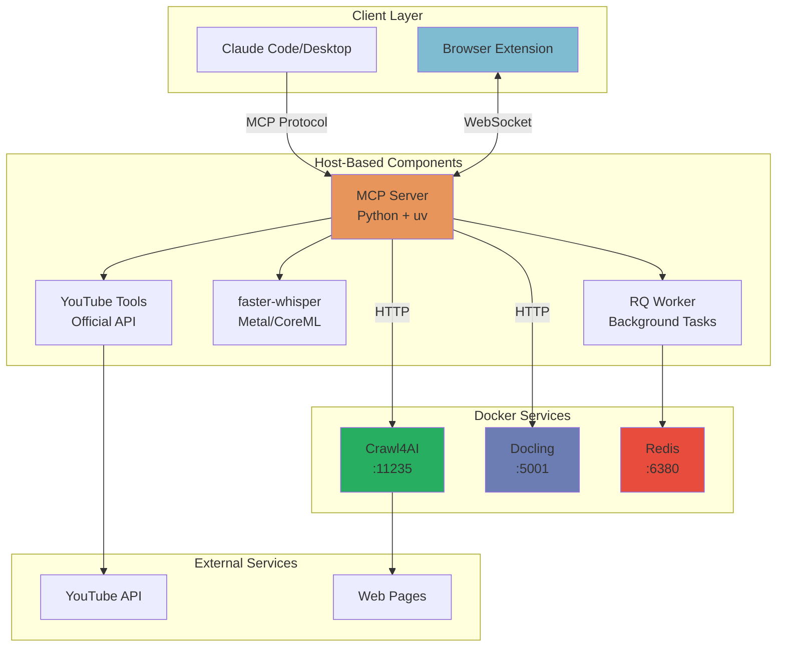

<p align="center">
  
</p>

# Gobbler MCP Server

> *Connecting Your Information to Your Agents*

Gobbler is a [Model Context Protocol (MCP)](https://modelcontextprotocol.io) server that converts various content types—YouTube videos, web pages, documents, and audio/video files—into clean, structured markdown with rich metadata.

[](https://opensource.org/licenses/MIT)
[](https://www.python.org/downloads/)
[](https://github.com/Enablement-Engineering/gobbler/actions/workflows/test.yml)
[](https://github.com/astral-sh/ruff)

## What's New

### Browser Extension with Multi-Tab Support

Control your browser from Claude with bidirectional communication. Extract pages, execute JavaScript, and automate workflows with a secure tab group model that protects sensitive tabs.

### Batch Processing with Real-Time Progress

Process entire YouTube playlists, directories of documents, or multiple web pages with controlled concurrency. Track progress in real-time with the new progress tracking system.

### Enhanced Security Model

Tab group-based security ensures Claude can only access tabs you explicitly add to the "Gobbler" group, preventing accidental access to sensitive information.

## Features

- **Browser Extension** - 🆕 Bidirectional communication with Chrome/Edge for live page extraction and automation
- **YouTube Transcripts** - Extract official transcripts with video metadata
- **YouTube Playlist Batch** - Process entire playlists with progress tracking
- **YouTube Downloads** - Download videos with quality selection
- **Web Scraping** - Convert any webpage to markdown (JavaScript-rendered content supported)
- **Batch Web Processing** - Convert multiple URLs to markdown concurrently
- **Document Conversion** - PDF, DOCX, PPTX, XLSX to markdown with OCR support
- **Batch Document Processing** - Convert directories of documents
- **Audio/Video Transcription** - Fast transcription using Whisper with Metal/CoreML acceleration
- **Batch Audio Processing** - Transcribe entire directories of audio/video files
- **Background Queue System** - Handle long-running tasks with Redis + RQ
- **Progress Tracking** - Real-time progress for batch operations
- **Clean Output** - YAML frontmatter + structured markdown
- **MCP Compatible** - Works with Claude Code, Claude Desktop, and any MCP client

## Quick Start

```bash
# 1. Install dependencies
curl -LsSf https://astral.sh/uv/install.sh | sh  # Install uv if needed
git clone https://github.com/Enablement-Engineering/gobbler.git
cd gobbler
make install

# 2. Start all services (Docker + worker)
make start

# 3. Verify installation
make status  # Check all services are healthy

# 4. Install to Claude Code
make claude-install  # Shows command to run

# 5. Use in Claude Code
# "Transcribe this YouTube video: https://youtube.com/watch?v=..."
```

## Architecture

Gobbler uses a **hybrid architecture** optimized for performance:



### Host-Based Components

- **MCP Server** (Python + uv) - Direct filesystem access, coordinates services
- **YouTube Tools** - No Docker required, uses official API
- **faster-whisper** - Local transcription with Metal/CoreML acceleration on M-series Macs
- **RQ Worker** - Background task processing
- **Browser Extension** - Bidirectional communication with Chrome/Edge

### Docker Services (Optional)

- **Crawl4AI** (port 11235) - Advanced web scraping with JavaScript rendering
- **Docling** (port 5001) - Document conversion with OCR
- **Redis** (port 6380) - Queue backend for long-running tasks

## Installation

### Prerequisites

- Python 3.11+
- [uv](https://docs.astral.sh/uv/) package manager
- Docker and Docker Compose (for web/document conversion)
- ffmpeg (for audio extraction from video)

### Setup

```bash
# Clone repository
git clone https://github.com/Enablement-Engineering/gobbler.git
cd gobbler

# Install Python dependencies
make install
# or: uv sync

# Start Docker services (optional, for web/doc conversion)
make start
```

### Claude Code Integration

```bash
# Show installation command
make claude-install

# Copy and run the displayed command:
claude mcp add gobbler-mcp -- uv --directory /path/to/gobbler run gobbler-mcp
```

### Claude Desktop Integration

Edit `~/Library/Application Support/Claude/claude_desktop_config.json`:

```json
{
  "mcpServers": {
    "gobbler-mcp": {
      "command": "uv",
      "args": [
        "--directory",
        "/FULL/PATH/TO/gobbler",
        "run",
        "gobbler-mcp"
      ]
    }
  }
}
```

Restart Claude Desktop after editing.

### Browser Extension Setup

The browser extension enables bidirectional communication - extract pages from Claude AND control the browser from Claude.

**Install Extension:**

1. **Chrome/Edge**:
   - Open `chrome://extensions/` or `edge://extensions/`
   - Enable "Developer mode"
   - Click "Load unpacked"
   - Select `/path/to/gobbler/browser-extension/`

2. **Verify Connection**:
   - Open the extension popup
   - Check for "🟢 Connected to Gobbler MCP"

See [browser-extension/CLAUDE.md](browser-extension/CLAUDE.md) for detailed documentation and examples.

## Available Tools

### `transcribe_youtube`

Extract YouTube video transcript with metadata.

**Parameters:**

- `video_url` (required) - YouTube URL
- `include_timestamps` (optional) - Include timestamp markers (default: false)
- `language` (optional) - Language code or 'auto' (default: 'auto')
- `output_file` (optional) - Path to save markdown file (auto-generates filename from title)

**Example:**

```
"Transcribe https://youtube.com/watch?v=dQw4w9WgXcQ to /Users/me/transcripts/"
```

### `download_youtube_video`

Download YouTube video with quality selection.

**Parameters:**

- `video_url` (required) - YouTube URL
- `output_dir` (required) - Directory to save video
- `quality` (optional) - 'best', '1080p', '720p', '480p', '360p' (default: 'best')
- `format` (optional) - 'mp4', 'webm', 'mkv' (default: 'mp4')
- `auto_queue` (optional) - Auto-queue if estimated > 1:45 (default: false)

**Example:**

```
"Download this YouTube video in 720p to /Users/me/Videos/"
```

### `fetch_webpage`

Convert webpage to markdown using Crawl4AI.

**Parameters:**

- `url` (required) - Full HTTP/HTTPS URL
- `include_images` (optional) - Include image references (default: true)
- `timeout` (optional) - Request timeout in seconds (default: 30, max: 120)
- `output_file` (optional) - Path to save markdown file

**Example:**

```
"Convert https://example.com/article to markdown"
```

**Requires:** Crawl4AI Docker container (`make start-docker`)

### `fetch_webpage_with_selector`

Extract specific content from webpage using CSS or XPath selectors.

**Parameters:**

- `url` (required) - Full HTTP/HTTPS URL
- `css_selector` (optional) - CSS selector (e.g., "article.main", "div#content")
- `xpath` (optional) - XPath expression (alternative to css_selector)
- `include_images` (optional) - Include image references (default: true)
- `extract_links` (optional) - Extract and categorize links (default: false)
- `session_id` (optional) - Session ID for authenticated crawling
- `bypass_cache` (optional) - Bypass cache for fresh content (default: false)
- `timeout` (optional) - Request timeout in seconds (default: 30, max: 120)
- `output_file` (optional) - Path to save markdown file

**Examples:**

```
"Extract the article from https://example.com/post using CSS selector 'article.main'"
"Get content from https://docs.example.com using selector 'div.content' and extract all links"
```

**Requires:** Crawl4AI Docker container (`make start-docker`)

### `create_crawl_session`

Create reusable browser session for authenticated crawling.

**Parameters:**

- `session_id` (required) - Unique identifier for the session
- `cookies` (optional) - JSON string of cookie objects
- `local_storage` (optional) - JSON string of localStorage key-value pairs
- `user_agent` (optional) - Custom user agent string

**Examples:**

```
cookies_json = '[{"name": "session_token", "value": "abc123", "domain": "example.com"}]'
"Create session 'my-site' with cookies: " + cookies_json

storage_json = '{"user_id": "12345", "theme": "dark"}'
"Create session 'my-app' with localStorage: " + storage_json
```

**Storage:** Sessions saved to `~/.config/gobbler/sessions/`

### `crawl_site`

Recursively crawl website and extract content with link graph generation.

**Parameters:**

- `start_url` (required) - URL to start crawling from
- `max_depth` (optional) - Maximum crawl depth (default: 2, max: 5)
- `max_pages` (optional) - Maximum pages to crawl (default: 50, max: 500)
- `url_include_pattern` (optional) - Regex pattern - only crawl matching URLs
- `url_exclude_pattern` (optional) - Regex pattern - skip matching URLs
- `css_selector` (optional) - Apply selector to all crawled pages
- `respect_robots_txt` (optional) - Respect robots.txt (default: true)
- `crawl_delay` (optional) - Delay between requests in seconds (default: 1.0)
- `concurrency` (optional) - Max concurrent requests (default: 3, max: 10)
- `session_id` (optional) - Session ID for authenticated crawling
- `output_dir` (optional) - Directory to save all pages as markdown files

**Examples:**

```
"Crawl https://docs.example.com with max depth 2 and max 20 pages"
"Crawl https://blog.example.com including only URLs matching '/posts/', excluding '/(tag|category)/', max 100 pages"
"Crawl https://app.example.com with selector 'article.content', session 'my-session', depth 3"
```

**Requires:** Crawl4AI Docker container (`make start-docker`)

### `convert_document`

Convert documents (PDF, DOCX, PPTX, XLSX) to markdown.

**Parameters:**

- `file_path` (required) - Absolute path to document
- `enable_ocr` (optional) - Enable OCR for scanned documents (default: true)
- `output_file` (optional) - Path to save markdown file

**Example:**

```
"Convert /Users/me/Documents/report.pdf to markdown with OCR"
```

**Requires:** Docling Docker container (`make start-docker`)

### `transcribe_audio`

Transcribe audio/video files using Whisper with Metal acceleration.

**Parameters:**

- `file_path` (required) - Absolute path to audio/video file
- `model` (optional) - 'tiny', 'base', 'small', 'medium', 'large' (default: 'small')
- `language` (optional) - Language code or 'auto' (default: 'auto')
- `output_file` (optional) - Path to save markdown file
- `auto_queue` (optional) - Auto-queue if estimated > 1:45 (default: false)

**Example:**

```
"Transcribe /Users/me/Videos/meeting.mp4 with auto-queue enabled"
```

**Performance:** Real-time transcription speed varies by model on M-series Macs with Metal/CoreML:

- `tiny`: ~6.7x faster than real-time
- `base`: ~5x faster than real-time
- `small`: ~3x faster than real-time (default)
- `medium`: ~2x faster than real-time
- `large`: ~1.25x faster than real-time

### `get_job_status`

Check status of queued background jobs.

**Parameters:**

- `job_id` (required) - Job ID returned when task was queued

**Example:**

```
"Check status of job abc123"
```

### `list_jobs`

List jobs in a queue.

**Parameters:**

- `queue_name` (optional) - 'default', 'transcription', 'download' (default: 'default')
- `limit` (optional) - Max results (default: 20, max: 100)

**Example:**

```
"List jobs in the transcription queue"
```

## Batch Processing Tools

Process multiple items efficiently with concurrency control and progress tracking.

### `batch_transcribe_youtube_playlist`

Extract transcripts from all videos in a YouTube playlist.

**Parameters:**

- `playlist_url` (required) - YouTube playlist URL
- `output_dir` (required) - Directory to save markdown transcripts
- `include_timestamps` (optional) - Include timestamp markers (default: false)
- `language` (optional) - Language code or 'auto' (default: 'auto')
- `max_videos` (optional) - Maximum videos to process (default: 100, max: 500)
- `concurrency` (optional) - Concurrent videos (default: 3, max: 10)
- `skip_existing` (optional) - Skip existing files (default: true)
- `auto_queue` (optional) - Queue if >10 videos (default: false)

**Example:**

```
"Transcribe all videos from this playlist to /Users/me/transcripts/ with auto_queue enabled"
```

**Returns:** Batch summary with success/failure counts and file list

### `batch_fetch_webpages`

Convert multiple web pages to markdown.

**Parameters:**

- `urls` (required) - List of URLs (max: 100)
- `output_dir` (required) - Directory to save markdown files
- `include_images` (optional) - Include image references (default: true)
- `timeout` (optional) - Request timeout per page (default: 30, max: 120)
- `concurrency` (optional) - Concurrent requests (default: 5, max: 10)
- `skip_existing` (optional) - Skip existing files (default: true)
- `auto_queue` (optional) - Queue if >10 URLs (default: false)

**Example:**

```python
urls = [
    "https://example.com/page1",
    "https://example.com/page2",
    "https://example.com/page3"
]
"Convert these URLs to markdown in /Users/me/pages/ with auto_queue enabled"
```

**Returns:** Batch summary with processing statistics

### `batch_transcribe_directory`

Transcribe all audio/video files in a directory.

**Parameters:**

- `input_dir` (required) - Directory containing audio/video files
- `output_dir` (optional) - Directory for transcripts (default: same as input)
- `model` (optional) - Whisper model size (default: 'small')
- `language` (optional) - Language code or 'auto' (default: 'auto')
- `pattern` (optional) - Glob pattern (default: '*' for all supported formats)
- `recursive` (optional) - Search subdirectories (default: false)
- `concurrency` (optional) - Concurrent files (default: 2, max: 4)
- `skip_existing` (optional) - Skip existing transcripts (default: true)
- `auto_queue` (optional) - Queue if >10 files (default: false)

**Supported formats:** mp3, mp4, wav, m4a, mov, avi, mkv, flac, ogg, webm

**Example:**

```
"Transcribe all audio files in /Users/me/podcasts/ recursively with auto_queue enabled"
```

**Returns:** Batch summary with processing statistics

### `batch_convert_documents`

Convert all documents in a directory to markdown.

**Parameters:**

- `input_dir` (required) - Directory containing documents
- `output_dir` (optional) - Directory for markdown (default: same as input)
- `enable_ocr` (optional) - Enable OCR (default: true)
- `pattern` (optional) - Glob pattern (default: '*' for all supported formats)
- `recursive` (optional) - Search subdirectories (default: false)
- `concurrency` (optional) - Concurrent conversions (default: 3, max: 5)
- `skip_existing` (optional) - Skip existing markdown (default: true)
- `auto_queue` (optional) - Queue if >10 documents (default: false)

**Supported formats:** pdf, docx, pptx, xlsx

**Example:**

```
"Convert all PDFs in /Users/me/documents/ to markdown with OCR and auto_queue enabled"
```

**Returns:** Batch summary with processing statistics

### `get_batch_progress`

Get real-time progress for a running batch operation.

**Parameters:**

- `batch_id` (required) - Batch ID returned when batch was started

**Example:**

```
"Check progress of batch abc-123-def-456"
```

**Returns:** Progress report with:

- Current status (running/completed/failed)
- Items processed / total items
- Success and failure counts
- Current item being processed
- Recent errors (if any)

### Browser Extension Tools

**Note:** Browser extension must be installed and connected. See [Browser Extension Setup](#browser-extension-setup).

**Security:** The browser extension uses a **tab group security model**. Only tabs in the "Gobbler" tab group can be accessed by Claude. This prevents accidental access to sensitive tabs.

- First use creates an orange "Gobbler" tab group with the current tab
- Add/remove tabs via extension popup or right-click context menu
- All browser commands enforce tab group membership

#### `browser_check_connection`

Check if browser extension is connected.

**Example:**

```
"Is my browser extension connected?"
```

**Returns:** Connection status message

#### `browser_list_tabs`

List all tabs in the Gobbler tab group.

**Parameters:**

- `filter` (optional) - Filter tabs by type (e.g., 'notebooklm' for NotebookLM tabs only)

**Example:**

```
"List all tabs in my Gobbler group"
"Show me my NotebookLM tabs"
```

**Returns:** List of tabs with tabId, title, url, and isActive status

#### `browser_execute_script_in_tab`

Execute JavaScript in a specific tab by ID (must be in Gobbler group).

**Parameters:**

- `tab_id` (required) - Tab ID from browser_list_tabs
- `script` (required) - JavaScript code to execute
- `timeout` (optional) - Timeout in seconds (default: 30, max: 150)

**Example:**

```
"Execute this script in tab 123: document.title"
```

**Returns:** Script result (formatted as JSON if object/array)

**Use Case:** Multi-instance scenarios like multiple NotebookLM notebooks open simultaneously.

#### `browser_extract_current_page`

Extract content from the current browser page.

**Parameters:**

- `selector` (optional) - CSS selector to extract specific content
- `timeout` (optional) - Timeout in seconds (default: 30)

**Example:**

```
"Extract the current page from my browser"
"Extract just the article from the current page using selector 'article.main'"
```

**Returns:** Markdown with YAML frontmatter

#### `browser_navigate_to_url`

Navigate the browser to a URL.

**Parameters:**

- `url` (required) - URL to navigate to
- `wait_for_load` (optional) - Wait for page load (default: true)
- `timeout` (optional) - Timeout in seconds (default: 30)

**Example:**

```
"Navigate my browser to https://docs.python.org"
```

**Returns:** Success or error message

#### `browser_execute_script`

Execute JavaScript in the current browser page.

**Parameters:**

- `script` (required) - JavaScript code to execute
- `timeout` (optional) - Timeout in seconds (default: 30)

**Example:**

```
"Get all links from the current page using JavaScript"
"Execute: Array.from(document.querySelectorAll('a')).map(a => a.href)"
```

**Returns:** Script result (formatted as JSON if object/array)

#### `browser_get_page_info`

Get metadata about the current browser page.

**Parameters:**

- `timeout` (optional) - Timeout in seconds (default: 30)

**Example:**

```
"What page am I currently on in my browser?"
```

**Returns:** JSON with url, title, hostname, link counts, etc.

**See:** [browser-extension/CLAUDE.md](browser-extension/CLAUDE.md) for detailed documentation and examples.

## Background Queue System

Long-running tasks can be queued for background processing:

```bash
# Start worker (included in 'make start')
make worker

# Or manually
uv run python -m gobbler_mcp.worker

# Stop worker
make worker-stop
```

**Auto-queue Feature:**

- Set `auto_queue: true` on supported tools
- Tasks estimated > 1:45 automatically queue
- Returns job_id and ETA
- Check progress with `get_job_status(job_id)`

**Queues:**

- `default` - General tasks
- `transcription` - Audio/video transcription
- `download` - YouTube downloads

## Configuration

User config location: `~/.config/gobbler/config.yml`

```yaml
# Whisper settings
whisper:
  model: small  # tiny, base, small, medium, large
  language: auto

# Docling settings
docling:
  ocr: true
  vlm: false

# Crawl4AI settings
crawl4ai:
  timeout: 30
  max_timeout: 120
  api_token: gobbler-local-token

# Redis queue settings
redis:
  host: localhost
  port: 6380
  db: 0

queue:
  auto_queue_threshold: 105  # seconds (1:45)
  default_queue: default

# Service endpoints
services:
  crawl4ai:
    host: localhost
    port: 11235
  docling:
    host: localhost
    port: 5001
```

## Makefile Commands

```bash
make help          # Show all available commands

# Quick start
make start         # Start everything (Docker + worker)
make start-docker  # Start only Docker services
make stop          # Stop all services

# Workers
make worker        # Start RQ worker (foreground)
make worker-stop   # Stop background workers

# Status and logs
make status        # Check service health
make logs          # View Docker logs

# Installation
make install       # Install dependencies
make claude-install # Show Claude Code installation command

# Testing
make inspector     # Launch MCP inspector
make test          # Run tests (when implemented)

# Cleanup
make clean         # Remove build artifacts
```

## Example Output

All tools return markdown with YAML frontmatter:

```markdown
---
source: https://youtube.com/watch?v=dQw4w9WgXcQ
type: youtube_transcript
title: "Rick Astley - Never Gonna Give You Up"
channel: "Rick Astley"
duration: 213
language: en
video_id: dQw4w9WgXcQ
word_count: 1547
converted_at: 2025-10-03T15:32:11Z
---

# Rick Astley - Never Gonna Give You Up

Never gonna give you up, never gonna let you down...
```

## Performance

- **YouTube transcripts:** < 1 second (no Docker required)
- **Web scraping:** 2-10 seconds depending on page complexity
- **Document conversion:** 5-30 seconds depending on size and OCR
- **Audio transcription:** Model-dependent speeds on M-series Macs (small model: ~3x faster than real-time)
- **Video transcription:** Auto-extracts audio first, then transcribes

## Troubleshooting

### Port 6379 already in use

Gobbler uses port 6380 for Redis to avoid conflicts. If you still have issues:

```bash
# Check what's using the port
lsof -i :6380

# Change port in config
vim ~/.config/gobbler/config.yml
# Update redis.port to different value
```

### Worker crashes with fork() errors on macOS

This is fixed in the latest version. Gobbler uses `SimpleWorker` which doesn't fork, making it compatible with CoreML/Metal on macOS.

### Services not starting

```bash
# Check logs
make logs

# Restart services
make stop && make start

# Check status
make status
```

### YouTube transcript not available

Some videos don't have transcripts. Try downloading and transcribing instead:

```
"Download this video and transcribe it with auto-queue"
```

## Development

### Setup

```bash
# Install dev dependencies
uv sync --dev
```

### Testing

Gobbler has comprehensive test coverage with unit tests, integration tests, and benchmarks.

```bash
# Run all tests
uv run pytest

# Run only unit tests (fast, no external services)
uv run pytest tests/unit/ -v

# Run with coverage report
uv run pytest --cov=src/gobbler_mcp --cov-report=html

# Run integration tests (requires Docker services)
make start-docker  # Start Redis, Crawl4AI
uv run pytest tests/integration/ -v -m integration

# Run benchmarks
uv run pytest tests/benchmarks/ -v -m benchmark
```

**Test Coverage:**

- Unit tests: 72+ tests covering converters and utilities
- Integration tests: Redis queue, Crawl4AI, MCP tools
- Current coverage: 38%+ (90%+ on tested modules)
- Target: 80%+ on core modules

### Code Quality

```bash
# Type checking
uv run mypy src/ --ignore-missing-imports

# Linting
uv run ruff check src/ tests/

# Format code
uv run ruff format src/ tests/

# Run all checks
uv run pytest && uv run ruff check src/ tests/
```

### MCP Inspector

```bash
# Test with MCP Inspector
make inspector
```

## Project Structure

```
gobbler/
├── src/gobbler_mcp/
│   ├── server.py          # MCP tools and server
│   ├── worker.py          # RQ background worker
│   ├── config.py          # Configuration management
│   ├── converters/        # Conversion implementations
│   │   ├── youtube.py     # YouTube transcript/download
│   │   ├── audio.py       # Whisper transcription
│   │   ├── webpage.py     # Crawl4AI web scraping
│   │   └── document.py    # Docling document conversion
│   └── utils/             # Shared utilities
│       ├── queue.py       # Redis/RQ queue management
│       ├── frontmatter.py # YAML frontmatter generation
│       ├── health.py      # Service health checks
│       └── http_client.py # HTTP client with retries
├── docker-compose.yml     # Service orchestration
├── Makefile              # Convenience commands
└── pyproject.toml        # Python dependencies
```

## Custom Slash Commands

Gobbler includes specialized slash commands for advanced workflows. These are stored in `~/.claude/scripts/gobbler/`:

- `/extract-playlist` - Extract complete YouTube playlist metadata with intelligent scrolling
- `/e2e-quick` - Quick end-to-end validation test
- `/e2e-full` - Comprehensive end-to-end testing
- `/e2e-validate` - Validate all MCP endpoints
- `/prd` - Product requirements document generator
- `/semantic-commit` - Generate semantic commit messages

To use these commands in Claude Code, they should be referenced in your prompt or custom instructions.

## Contributing

Contributions welcome! Please:

1. Fork the repository
2. Create a feature branch
3. Make your changes
4. Add tests if applicable
5. Submit a pull request

See [ARCHITECTURE.md](ARCHITECTURE.md) for design decisions.

## License

MIT License - see [LICENSE](LICENSE) file for details.

## Acknowledgments

- [Model Context Protocol](https://modelcontextprotocol.io) by Anthropic
- [FastMCP](https://github.com/jlowin/fastmcp) framework
- [Crawl4AI](https://github.com/unclecode/crawl4ai) for web scraping
- [Docling](https://github.com/DS4SD/docling) for document conversion
- [faster-whisper](https://github.com/SYSTRAN/faster-whisper) for transcription
- [yt-dlp](https://github.com/yt-dlp/yt-dlp) for YouTube downloads

## Support

- **Issues:** <https://github.com/Enablement-Engineering/gobbler/issues>
- **Discussions:** <https://github.com/Enablement-Engineering/gobbler/discussions>
- **MCP Docs:** <https://modelcontextprotocol.io>
