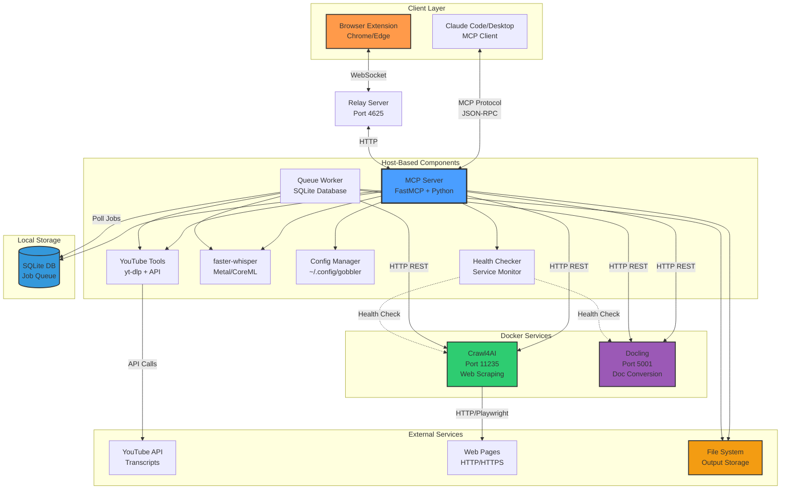
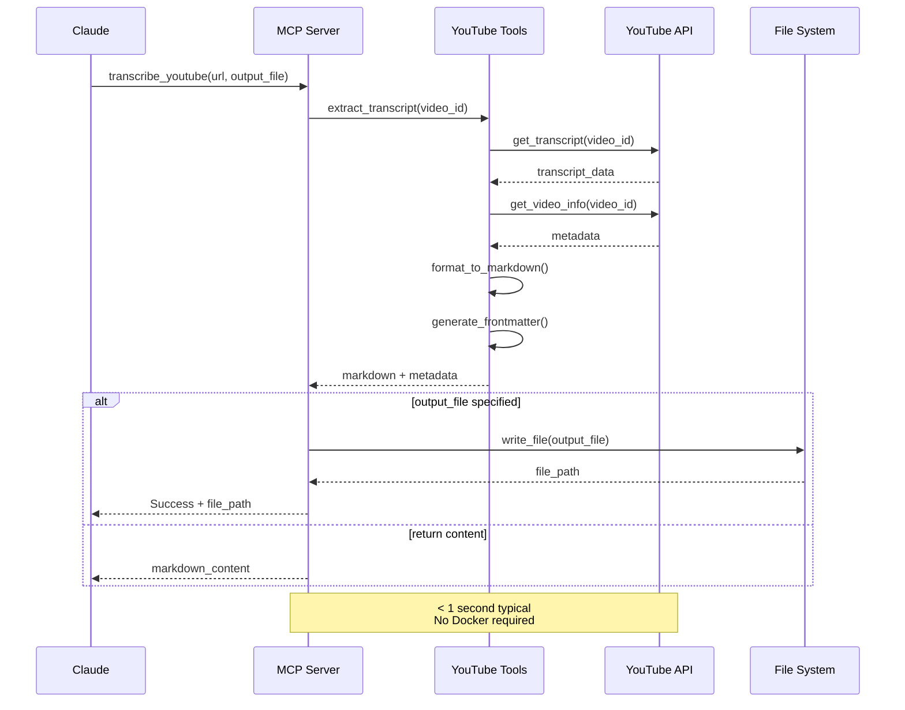
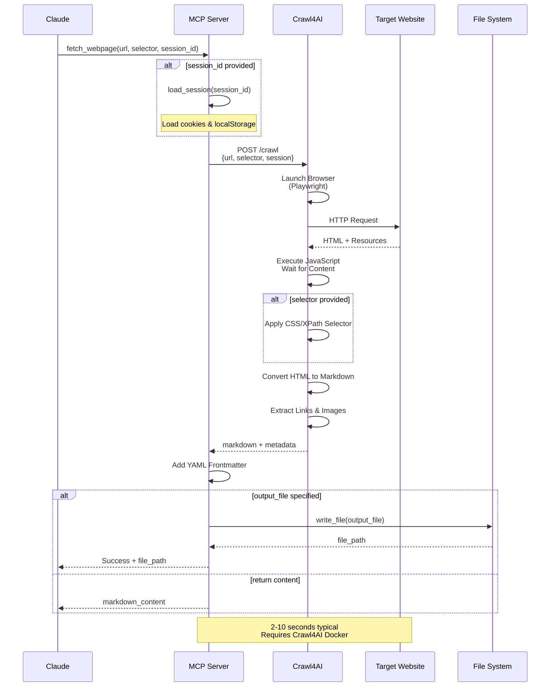
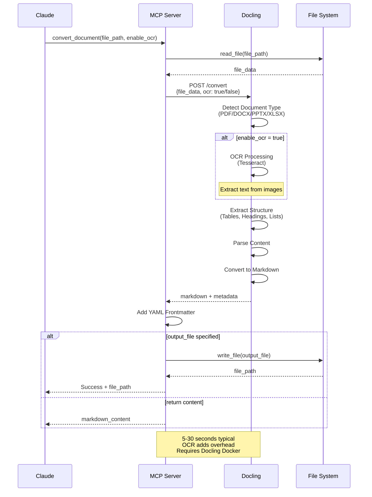
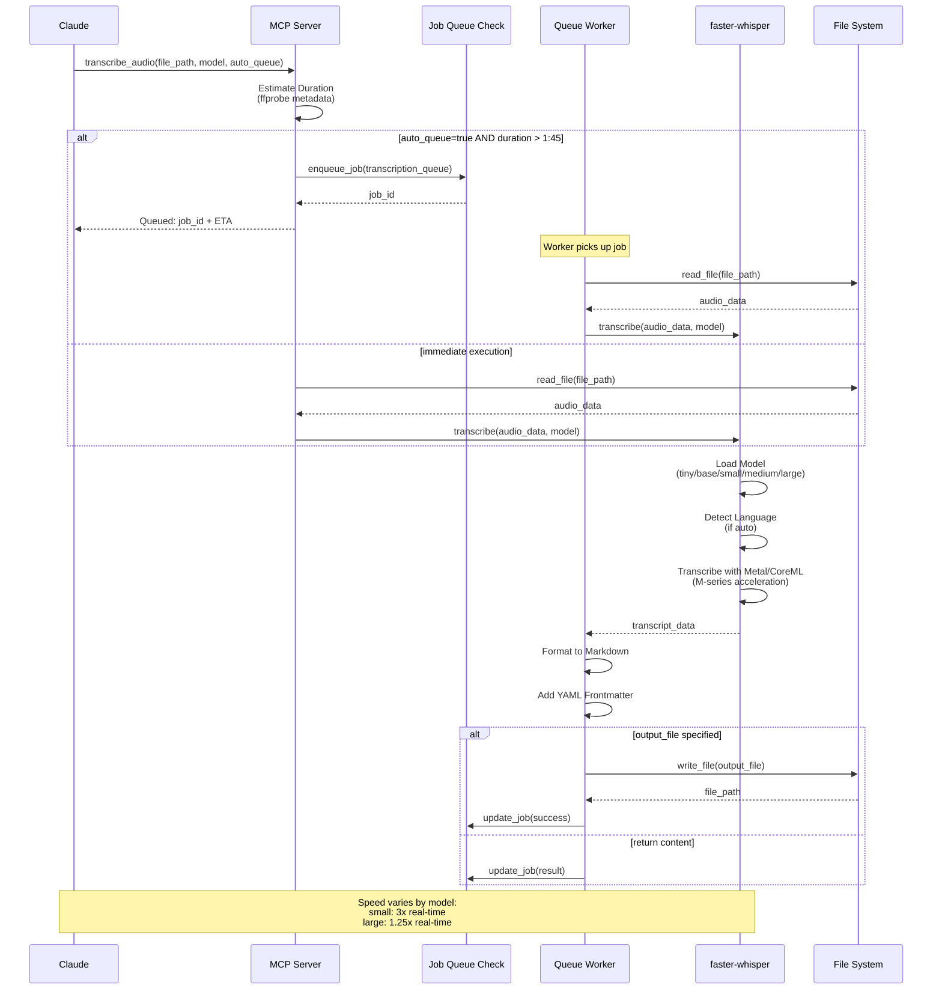
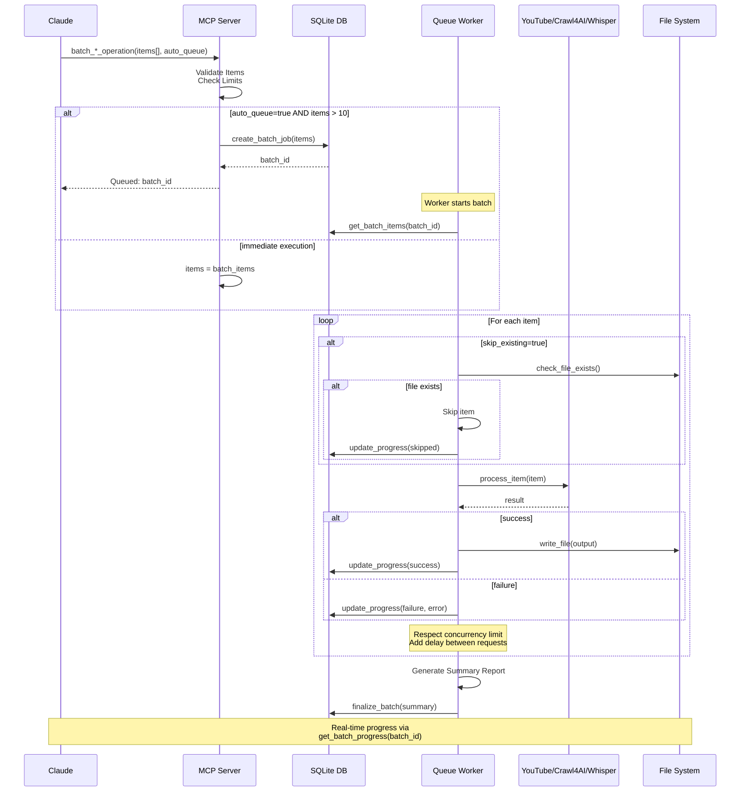
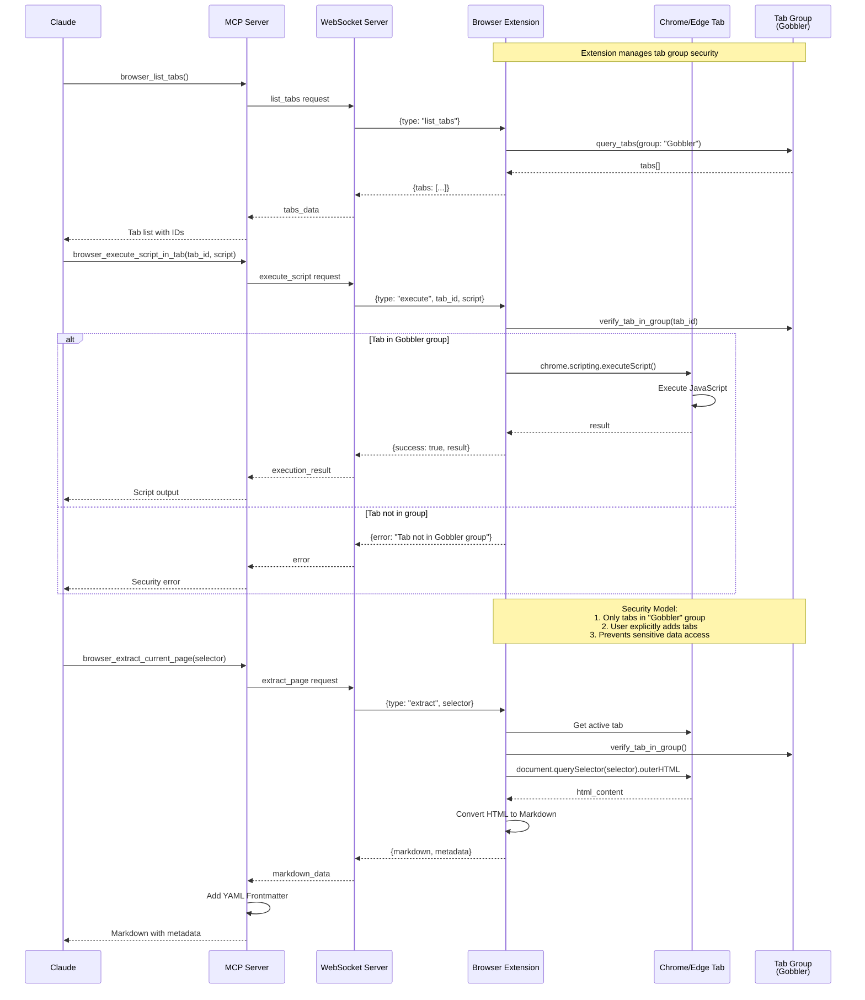
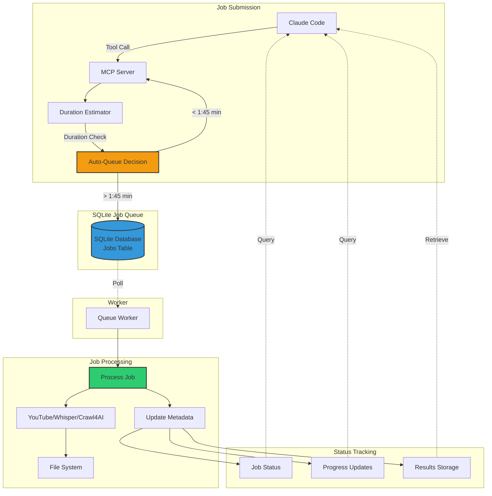
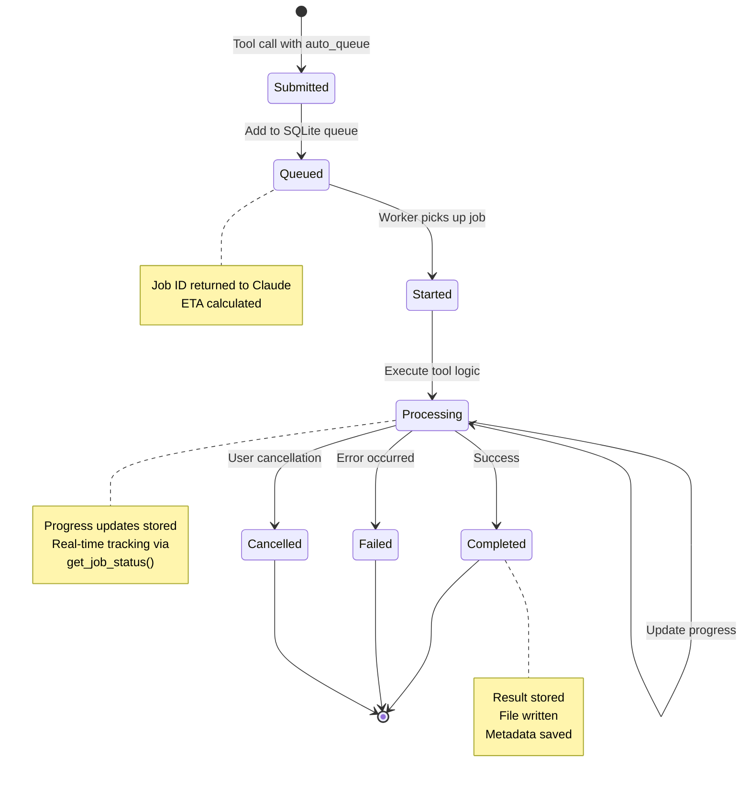

# Gobbler Architecture - Visual Guide

Visual diagrams of Gobbler's architecture, data flows, and component interactions.

## Table of Contents

- [System Architecture](#system-architecture)
- [Data Flow Diagrams](#data-flow-diagrams)
  - [YouTube Transcript Flow](#youtube-transcript-flow)
  - [Web Scraping Flow](#web-scraping-flow)
  - [Document Conversion Flow](#document-conversion-flow)
  - [Audio/Video Transcription Flow](#audiovideo-transcription-flow)
  - [Batch Processing Flow](#batch-processing-flow)
- [Browser Extension Communication](#browser-extension-communication)
- [Background Queue System](#background-queue-system)

## System Architecture

## Data Flow Diagrams

### YouTube Transcript Flow

### Web Scraping Flow

### Document Conversion Flow

### Audio/Video Transcription Flow

### Batch Processing Flow

## Browser Extension Communication

## Background Queue System

### Queue Job Lifecycle

## Component Responsibilities

### MCP Server
- Handle MCP protocol communication with Claude clients
- Route tool calls to appropriate converters
- Manage configuration and health checking
- Coordinate between services
- Handle auto-queue decisions

### Browser Extension
- Maintain WebSocket connection to MCP server
- Enforce tab group security model
- Execute scripts in managed tabs
- Extract page content and convert to markdown
- Provide tab management UI

### Queue Worker
- Poll SQLite database for background jobs
- Execute long-running tasks
- Update job progress and status
- Handle retries and error reporting
- Write results to file system

### Docker Services
- **Crawl4AI**: Web scraping with JavaScript rendering
- **Docling**: Document conversion with OCR

### Local Services
- **SQLite Database**: Job queue and state management
- **Relay Server**: WebSocket bridge for browser extension

### Converters
- **YouTube Tools**: Transcript extraction and video downloads
- **faster-whisper**: Audio/video transcription with Metal acceleration
- **Webpage Converter**: HTML to markdown conversion
- **Document Converter**: Multi-format document processing

## Performance Characteristics

| Operation | Typical Duration | Requires Docker | Auto-Queue Eligible |
|-----------|-----------------|-----------------|---------------------|
| YouTube Transcript | < 1 second | No | No |
| Web Scraping | 2-10 seconds | Yes (Crawl4AI) | No |
| Document Conversion | 5-30 seconds | Yes (Docling) | Yes (if > 1:45) |
| Audio Transcription (small) | 3x real-time | No | Yes (if > 35 sec) |
| Video Download | Varies by size | No | Yes (always) |
| Batch Processing | Minutes-hours | Varies | Yes (if > 10 items) |

## Security Model

### Tab Group Security
1. Browser extension creates "Gobbler" tab group on first use
2. Only tabs explicitly added to group are accessible
3. All browser commands verify tab group membership
4. User controls which tabs Claude can access
5. Prevents accidental exposure of sensitive information

### Service Isolation
1. Docker services run in isolated containers
2. Host-based components use local-only connections
3. SQLite job database stored locally
4. No external network access except for intended APIs
5. Configuration stored in user-specific directory

### API Security
1. Crawl4AI uses local API token
2. No cloud service credentials required
3. All processing happens locally
4. YouTube uses official public API
5. No data sent to external services except source URLs
